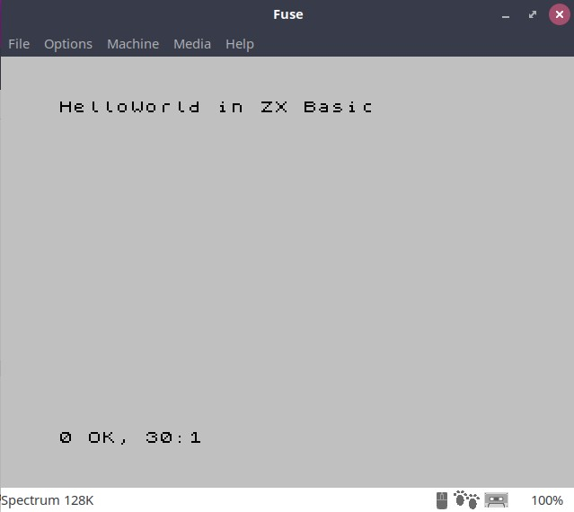

# HelloWorld in ZX Basic

## 1. Implementation of the program

A simple and typical helloworld in ZX Basic

```basic
10 CLS
20 PRINT "HelloWorld in ZX Basic"
```

## 2. Compile the program

Create the target file executing:

```shell
$ zxbc.py -taB hello.bas
```

## 3. Load the program in FUSE emulator

We will obtain this result:

